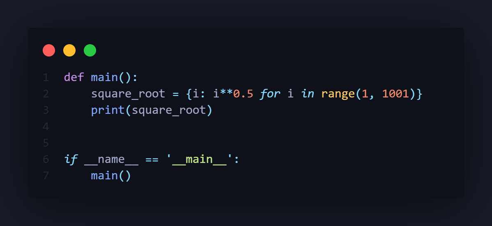

# Python dictionary comprehension



<br>

---

<br>

## Clone

Clone repository using `git clone` command from your CLI

With SSH:
```

git clone git@github.com:itsarreguin/comprehension.git

```

With HTTPS
```

git clone https://github.com/itsarreguin/comprehension.git

```

## Run code in CLI
Run this codes using `python` or `py` command in Windows or `python3` in MacOS
```

python3 file_name.py

```
```

py file_name.py

```
```

python file_name.py

```